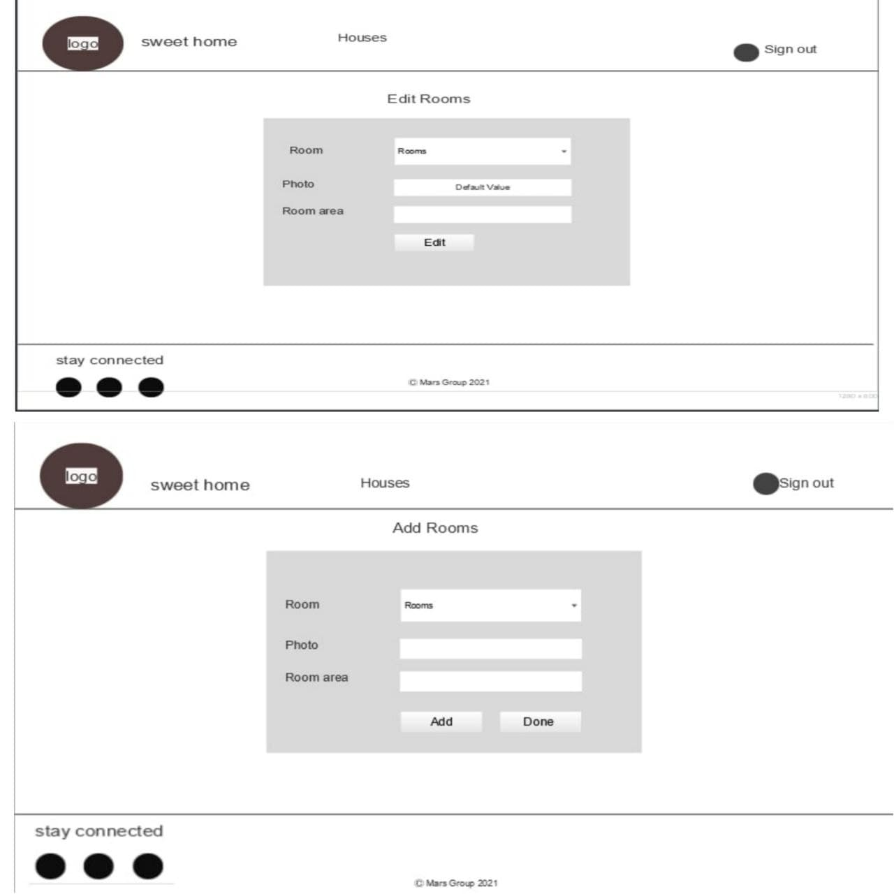
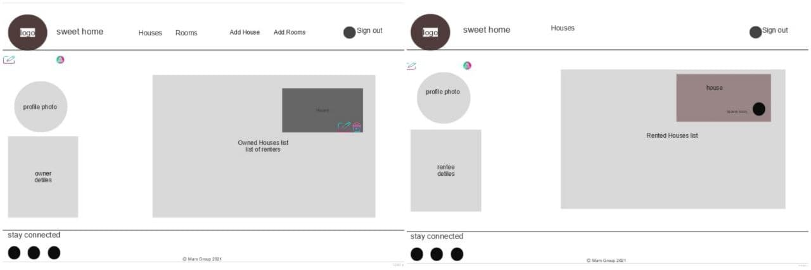

# sweet Home
 Our website is considered as a Home rental system offering some features for the House Owners and for Renters.

## Technologies 
 - Java
 - JQuery
 - Vanilla javascript
 - Spring Boot
 - JPA
 - JSP
 - jstl
 - MySQL Driver
 - Tailwind css
 - Bootstrap
 - Fontawsome
 - Eclipse
 - MySQL Workbench
 - Use sqlDBM for create ER diagram.
 - Use Justinmind to create our Mockup for the project.
 - Use lucid to create team workflow board.
 - Use Githup for commit/push/pull/merge the project.
 - AWS RDS
 - AWS EB

## ER Diagram


## User Stories:
 - As a visitor, I prefer not asked to register, so that I can view the houses and it’s details without having an account.
 
 
 - As a visitor, I prefer to see the availability of the houses for rent, so that I can have an idea of the house's current availability state.
  
  
 - As a visitor, I want to be able to do registration, so that I can have further features related to my account type.


 - As a visitor, I want to have account options, so that I can choose my role I want.


 - As a registered user(owner/renter), I want to have an edit option for my profile info, so that I can update my info when I want.


 - As a registered user(owner/renter), I want to have an edit option for my password, so that I can change my password when I want.


 - As a registered user(owner/renter), I want to have my own profile, so that I can view everything related to me.


 - As a registered user(owner/renter), I want my own profile to be public, so that anyone can view it.


 - As a house’s owner user, I want to have my own profile, so that I can view a list of the houses which is owned by me.


 - As a house’s owner user, I want to have my own profile, so that I can view a list of the houses with the Renters.


 - As a house’s owner user, I want to have an add house option, so that I can add my owned houses to the system.


 - As a house’s owner user, I want to have an edit house option, so that I can edit my owned houses in the system.


 - As a house’s owner user, I want to have a delete house option, so that I can delete my owned houses with it’s related rooms from the system.


 - As a house’s owner user, I want to have a more detail option on the houses, so that any visitor can see the details.


 - As a house’s owner user, I want to have an add room option, so that I can add rooms to my owned houses to the system.


 - As a house’s owner user, I want to have an edit room option, so that I can edit rooms of my owned houses in the system.


 - As a house’s owner user, I want to have a delete room option, so that I can delete any room from my owned houses from the system.


 - As a house’s renter user, I want to have my own profile, so that I can view a list of the houses which is rented by me.


 - As a house’s renter user, I want a contact owner option, so that I can view the house’s owner profile a list of the houses which he/she own.


 - As a house’s renter user, I want a rent option, so that I can rent any available house that I want.


 - As a house’s renter user, I want a leave option, so that I can leave the current house I rented and make it available for rent.
 
## Planning/Development process and Team work strategy
 
 
## Mockups






## Stretch Goals
- Allow user to update their own user profile. <b>Done</b>
- Allow a user to update their password.<b>Done</b>
- Recorded video demo of your application.<b>Done</b>

## Installation
 -  Tailwind css
<ol>
   <li>
   In the head section of your project paste the cdn,
    but with limited features. If you like to have all features you can follow the steps bellow.
   </li>
   <li>
   Open VScode 
   </li>
   <li>
   Open terminal, paste 
    
  ```
npx tailwindcss-cli@latest build -o tailwind.css .
```
  </li>
  <li>
   After run this command file called <b>tailwind.css</b> paste this file to the css folder of the project you want to use tailwind in
   </li>
   <li>
   Paste this in your head section
 
 ```
    <link href="/tailwind.css" rel="stylesheet">
```
   </li>
   <li>
  [For more information] (https://tailwindcss.com/docs/installation)
    </li>
</ol>
    
   <br>
   <br>
  -  Bootstrap
  <ol>
  <li>
   In the head section of your project paste the cdn of css
   
   ```
   <link href="https://cdn.jsdelivr.net/npm/bootstrap@5.0.0-beta1/dist/css/bootstrap.min.css" rel="stylesheet" integrity="sha384-giJF6kkoqNQ00vy+HMDP7azOuL0xtbfIcaT9wjKHr8RbDVddVHyTfAAsrekwKmP1" crossorigin="anonymous">
   ```
   </li>
   <li>
   In the body section of your project paste the cdn of js
 
 ```
 <script src="https://cdn.jsdelivr.net/npm/bootstrap@5.0.0-beta1/dist/js/bootstrap.bundle.min.js" integrity="sha384-ygbV9kiqUc6oa4msXn9868pTtWMgiQaeYH7/t7LECLbyPA2x65Kgf80OJFdroafW" crossorigin="anonymous"></script>
 ```
   </li>
   <li>
     [For more information] (https://getbootstrap.com/)
   </li>
</ol>   
