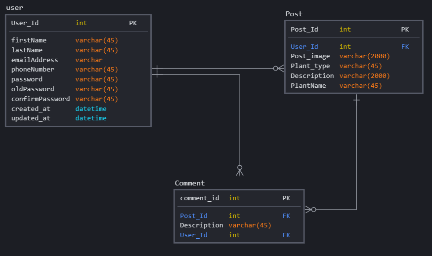

# Crocus: A Description

Crocus application is used to spread knowledge about plant species and ways to care for them, and to educate people about plants, and share the interest in the plant. Where you can post a picture of the plant with an overview and allow other people to comment on it, so Let's share about how to care for plants.

## Important Links

- [Front end repo](https://git.generalassemb.ly/ameenalfifi/CrocusStyle)
- [Deployed API](http://crocuswebapp007-env.eba-mzvkpuwp.us-east-2.elasticbeanstalk.com/)
- [Deployed Client](https://pages.git.generalassemb.ly/shaden240/CrocusStyle/)

## Planning Story

first plan We choose idea for web app and draw Application idea (ERD , class diagram) then how access to front end, back end Via (React,Server,database). Finally, we decide to work on both the front end and the back end. First, we were working on the back end by establishing the models and controllers and the relationships, then we moved to the front end by dividing the components between us.  

### Technologies Used

- Java
- Spring boot
- MySQL
- AWS Deployment
- JWT Authentication 
- Postman
- SqlDBM

### Unsolved Problems

- Still need to work on the admin account to allow the admin account to manage all posts and comments for all users.
- When the Front-end app was published, there was a problem retrieving data and images.
- We have a small problem with every form in the application after each submission needs to be refresh. So, the labels need to be back to their original state.

### planning, process and problem-solving strategy

- The problem: When delete the post, the comments needs to deleted with it. 
	
- The solution: this code will solve the problem(` @OneToMany(cascade = CascadeType.REMOVE,
	mappedBy = "post")
	private Set<Comment> comments; `)

#### ER Diagram

### Catalog of Routes

Verb         |	URI Pattern
------------ | -------------
POST   | /user/registration/:user
POST   | /user/authenticate/:user
GET    | /user/userProfile/:emailAddress
POST   | /post/add/:post
GET    | /post/index
Get    | /post/detail/:id
PUT    | /post/edit/:post
DELETE | /post/delete/:id
POST   | /comment/add/:comment
GET    | /comment/index
DELETE | /comment/delete/:id

## Set up and installation instructions 

### Spring Boot

-  set up the application using [spring initializr](https://start.spring.io/)
-  Create a REST controller
-  Use Postman to test the API.

### Spring Profile

- A Spring Profile was created to create an environment for the development of the application

### Spring Data

- These App have Three models: User, Post and Comment. The database for these application is MySQL.

### Add Authorization and Authentication

Set up Java Spring boot JWT Authorization and Authentication

- Authentication

 The authentication is the process of recognizing a user's identity.
 
 - The JWTresponse will return token.
 - The jwtUtil will use secret key to get user name from the token, check both expire and the user name received from the token to validate it and verify if the token has expired.
 
 - Validation
 
 The JwtRequestFilter class will filter every request. So, every request should be authenticated to pass it to the server.  
